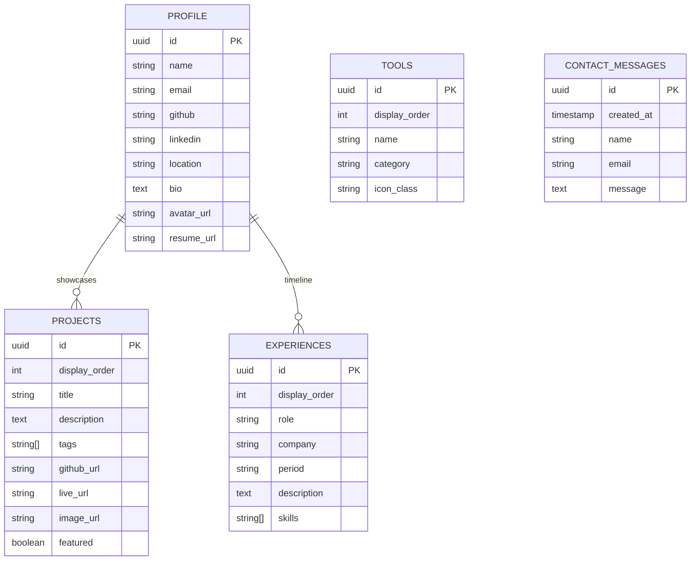

# System Architecture & Technical Documentation

## 1. System Overview & Technology Stack
This repository contains the interactive terminal portfolio for **Mustapha Haadi** (Cloud & DevOps Engineer / AWS Certified Practitioner).

```
 ┌─────────────────────────────────────────────────────────────┐
 │                Client Browser (Desktop/Mobile)              │
 └──────────────────────────────┬──────────────────────────────┘
                                │ HTTPS / CDN
 ┌──────────────────────────────▼──────────────────────────────┐
 │              Vercel Global Edge Network                     │
 │          React SPA + Vite Build (16 kB CSS)                 │
 └──────┬───────────────────────┬──────────────────────┬───────┘
        │                       │                      │
        ▼                       ▼                      ▼
┌───────────────┐     ┌──────────────────┐    ┌─────────────────┐
│  GitHub API   │     │  Supabase Cloud  │    │ Email Webhook   │
│ (Events Feed) │     │ (PostgreSQL DB)  │    │  (Formspree)    │
└───────────────┘     └──────────────────┘    └─────────────────┘
```

- **Frontend Core**: React 18 + Vite SPA
- **State & Data Fetching**: TanStack React Query v5
- **Styling**: Pure CSS Design Tokens (`index.css`) + Tailored Utilities (Purged Tailwind bundle: 16 kB)
- **Database & Auth**: Supabase PostgreSQL Serverless
- **Continuous Integration**: GitHub Actions CI (`.github/workflows/ci.yml`) + Vitest (`npm test`)

---

## 2. Database Schema (Supabase PostgreSQL)



---

## 3. Data Flow Architecture

```mermaid
sequenceDiagram
    autonumber
    actor User as Visitor
    participant SPA as React SPA (Client)
    participant RQ as React Query Cache
    participant SB as Supabase DB
    participant GH as GitHub API
    participant Mail as Email Endpoint

    User->>SPA: Load Application
    SPA->>RQ: Fetch Profile, Projects, Experiences
    alt Supabase Connected
        RQ->>SB: SELECT * FROM tables
        SB-->>RQ: Return JSON Rows
    else Fallback Mode
        RQ-->>SPA: Return Pre-loaded Local Data
    end
    SPA->>GH: GET /users/mustaphahaadi/events
    GH-->>SPA: Return Recent Push Events ($ git log)

    User->>SPA: Submit Contact Form
    SPA->>SB: INSERT INTO contact_messages
    SPA->>Mail: POST message alert to mustaphahaadi04@gmail.com
    SPA-->>User: Display Toast Success (&gt; message_sent)
```

---

## 4. Performance Metrics

| Asset Type | Standard Tailwind | Optimized Portfolio | Improvement |
| :--- | :--- | :--- | :--- |
| **CSS Bundle** | 3.40 MB | **16.05 KB** | **99.5% reduction** |
| **Gzip Size** | ~400 KB | **4.28 KB** | **98.9% reduction** |
| **Test Suite** | 0 Tests | **5 Tests (100% Pass)** | Automated CI |
